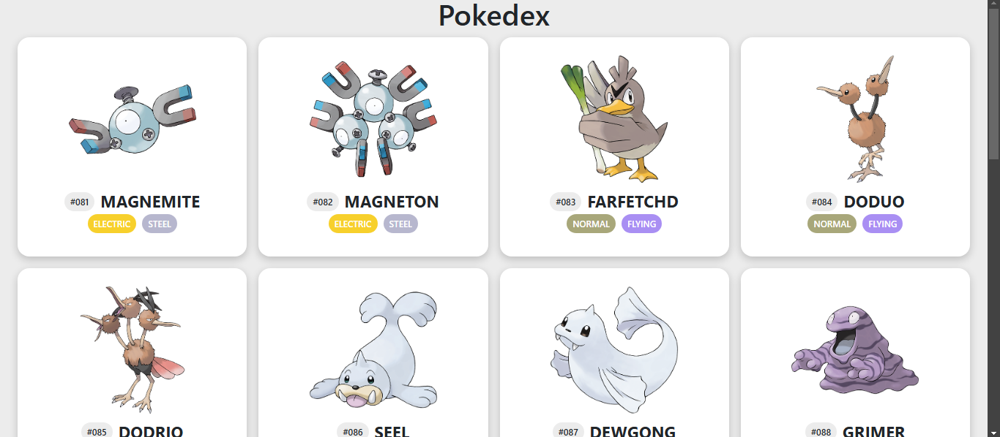
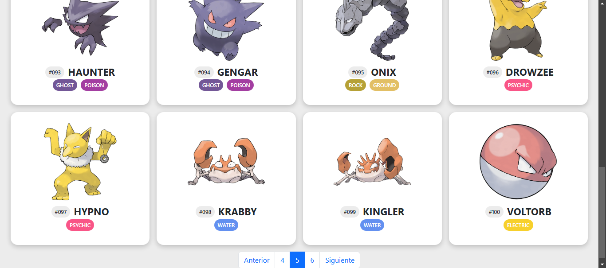

# Pokédex

Una Pokédex interactiva hecha en JavaScript que muestra información de Pokémon utilizando la [API pública de PokéAPI](https://pokeapi.co/).

## Descripción

Este proyecto permite visualizar Pokémon en un formato de lista con información básica como el nombre, la imagen, los tipos y el ID.

## Características

- **Visualización de Pokémon**: Muestra una lista de Pokémon con sus nombres, imágenes y tipos.
- **Paginación**: Navega entre páginas de Pokémon.

## Requisitos

- Un navegador moderno (Chrome, Firefox, Safari, etc.)
- Conexión a internet para acceder a la API de Pokémon.

## Instalación
1. **Clonar el repositorio:**
2. **Descarga dependencias "npm install"**

## Imágenes 

